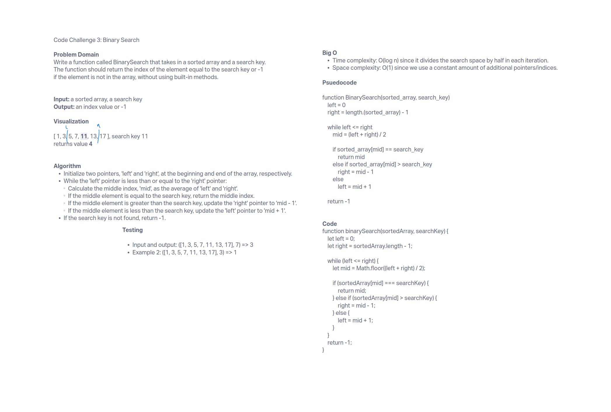

## Binary search

### Feature Tasks

Write a function called BinarySearch which takes in 2 parameters: a sorted array and the search key. Without utilizing any of the built-in methods available to your language, return the index of the array’s element that is equal to the value of the search key, or -1 if the element is not in the array.

**NOTE** - This is a whiteboard challenge only.

#### Whiteboard UML

#### Approach

I had a lot of trouble with this one.  After I looked up an explanation of the binary search method I visualized it by looking up some GIFs, then saw one was in the actual code instructions.  I used ChatGPT to generated psuedocode since I'm not at all comfortable on that yet, and used Replit to get proof of life.
