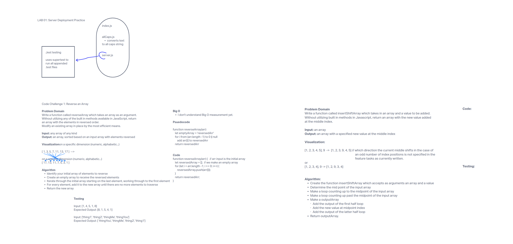

## Insert and shift an array

### Feature Tasks

Write a function called insertShiftArray which takes in an array and a value to be added. Without utilizing any of the built-in methods available to your language, return an array with the new value added at the middle index.

**NOTE** - This is a whiteboard challenge only.

#### Whiteboard UML

#### Approach

4/4/2023: I haven't completed this as I haven't written the code or the test cases in my whiteboard.  I have a pretty solid idea of how to proceed but I had to step away to deal with a family issue in the afternoon.  I'm submitting it incomplete for the moment and will finish tomorrow.
