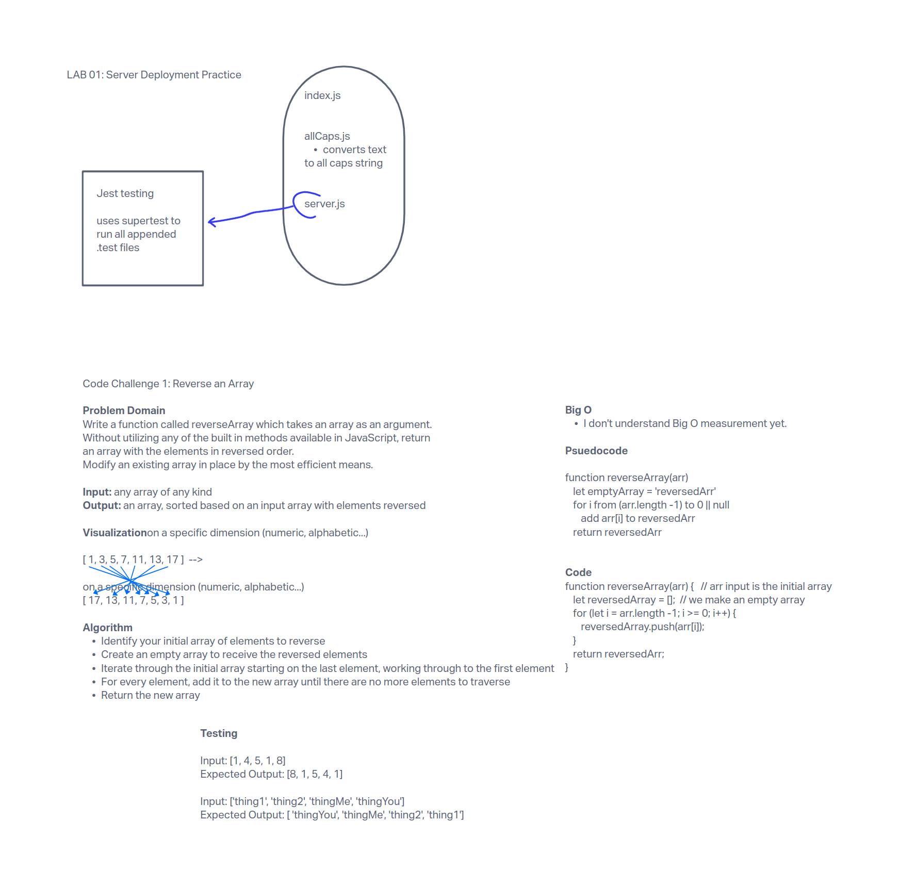

## Reverse an Array

### Feature Tasks

Write a function called reverseArray which takes an array as an argument. Without utilizing any of the built-in methods available to your language, return an array with elements in reversed order.

**NOTE** - This is a whiteboard challenge only.

#### Whiteboard UML

#### Approach

I tried to follow the whiteboarding layout on Canvas as much as possible, but I caught myself making assumptions about the feature task that aren't supported by the documentation.  For example, I thought I was supposed to reverse arrays in a specific order, like numerical.  This is not so.
