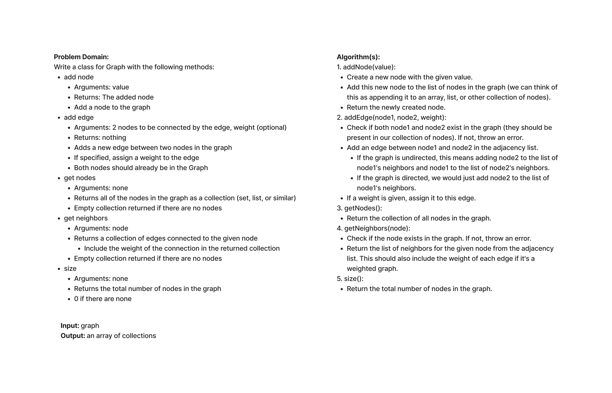

# Graph

This is an implementation of a Graph data structure with the following methods:

## Methods

- `addNode(value)`: Adds a node to the graph, returns the added node.
- `addEdge(startNode, endNode, weight)`: Adds a new edge between two nodes. If a weight is specified, it assigns that weight to the edge.
- `getNodes()`: Returns all of the nodes in the graph as a collection.
- `getNeighbors(node)`: Returns a collection of edges connected to the given node.
- `size()`: Returns the total number of nodes in the graph.

### Whiteboard

#### Approach/Efficiency

Time: O(n)
Space: O(n)
