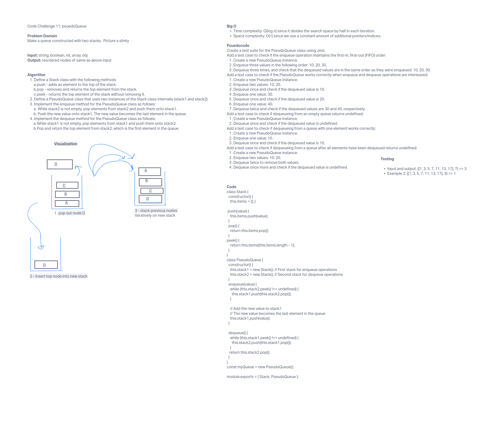

# Stack Queue Animal Shelter

A code challenge to practice using stacks and queues.

## Challenge

Create a class called `AnimalShelter` which holds only dogs and cats. The shelter operates using a first-in, first-out approach. Implement methods for enqueueing and dequeueing animals based on the given preference for dogs or cats.

## Approach & Efficiency

We use two separate queues to store dogs and cats. This way, we can maintain the order of arrival for each species. The `enqueue` method checks the animal's species and pushes it to the appropriate queue, while the `dequeue` method removes and returns the first animal from the specified queue.

The time complexity for enqueueing and dequeueing operations is BigO(1).  The space complexity is Big0(1n).

### Tests

Enqueue animals and maintain the order for dogs and cats separately.
Dequeue with invalid preference returns null.
Enqueue with invalid species does not add the animal to the shelter.

#### UML

