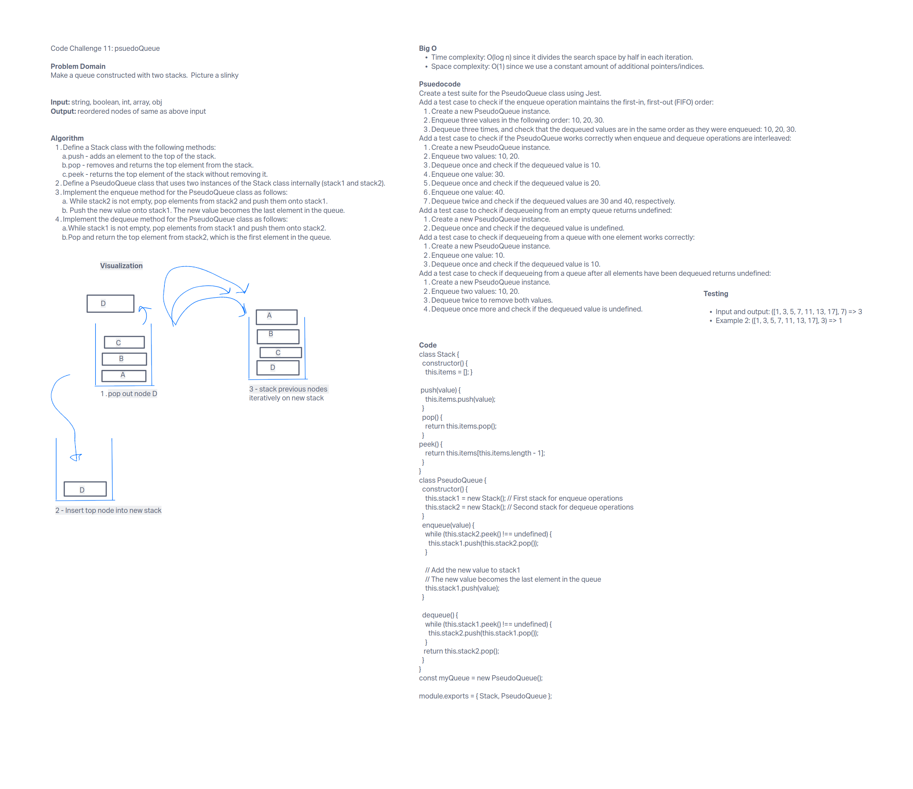

# Stacks and Queues: psuedoQueue

## Feature Tasks

Create a new class called pseudo queue.  Do not use an existing Queue.  Instead, this PseudoQueue class will implement our standard queue interface (the two methods listed below).Internally, utilize 2 Stack instances to create and manage the queue.
Methods:
enqueue
Arguments: value
Inserts a value into the PseudoQueue, using a first-in, first-out approach.
dequeue
Arguments: none
Extracts a value from the PseudoQueue, using a first-in, first-out approach.

The objective for this code challenge is to use the stack data structure to manipulate queues.

### Whiteboard UML

### Approach/Efficiency

Big O:
- time: O(2n)
- space: O(1)

#### Tests

Run npm test psuedoQueue.test.js in the project folder.
