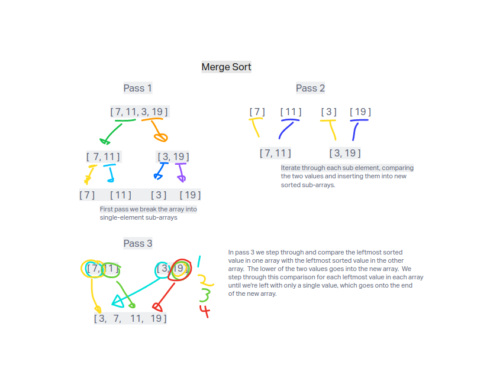

# Notes on Merge Sort algorithm

## Introduction

Merge Sort is a sorting algorithm that's superior to JavaScript's built in sort() method for dealing with large data sets. In an effort to better learn sorting algorithms, my goal is to take the provided psuedocode and step through a visual solution.

The basic idea of Merge Sort is to take an array, divide it in half, then divide those halves in half until you have arrays that are either empty or have single elements.  The sorting really occurs when you merge all these single element arrays back into a single sorted array, by taking in the smallest remaining element from the input arrays until complete.

What I didn't understand at first was what utility we gain by using this sorting algorithm that we don't get with a built in method.  Interestingly, if you use JavaScript's sort() method, the actual method used under the hood is apparently different browser to browser!  Because of that, it's not guaranteed to be efficient; doubling the input size of a quadratic method increases the processing time by MORE than double.

With Merge Sort you have a worst case O(n log n) complexity, while built in methods could have quadratic O(n^2) complexity.  If like me you are not good at math, the takeaway here is if you double the input size for a Merge Sort, the time it takes to run goes up by less than double.

### Visualization

